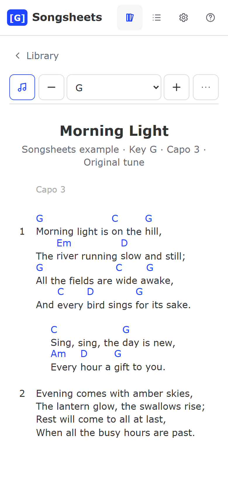
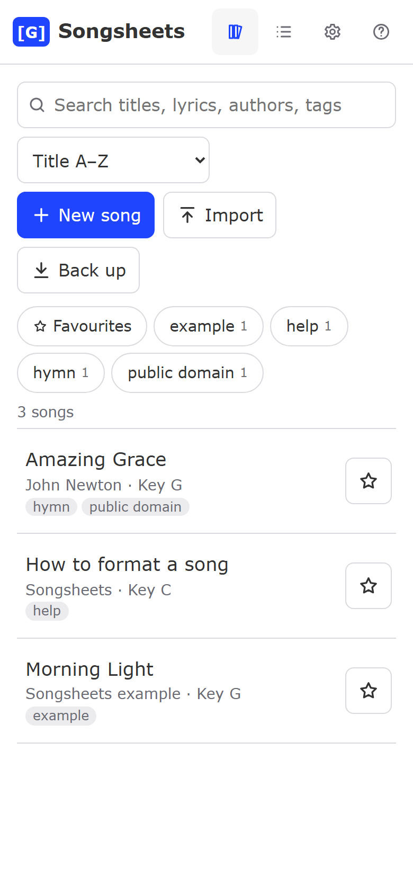
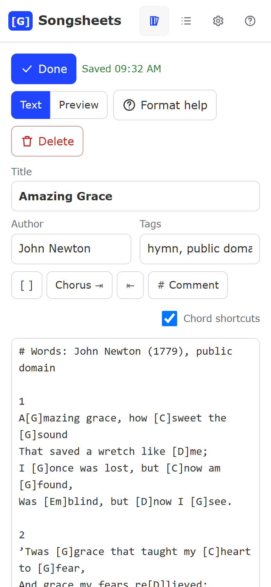

# Songsheets

Write your own chord song sheets, transpose them to any key, organise them into set lists, and
export them as PDF, Word, ChordPro, plain text, songbase text, a stand-alone web page or a JSON
backup. It is plain HTML, CSS and JavaScript with no server and no build step. Your songs are kept
in your browser's local storage.

The song format, the way chords sit over the lyrics, and the transposition tables come from
[songbase](https://github.com/ReganRyanNZ/songbase) by Regan Ryan (MIT licence). Text copied from
songbase pastes into Songsheets unchanged, and the other way round.

**Try it:** <https://rogerdewald.github.io/songsheets/>

<p align="center">
  
  
  
</p>

## Running it

- **No install:** double-click `index.html`. Everything except offline caching works from a file.
- **Local web server:** `python tools/serve.py` then open <http://localhost:8123/>. This server
  turns caching off, which is handy while editing the code.
- **Free hosting:** publish the folder with GitHub Pages (see below). The app then works offline
  after the first visit and can be installed as an app on phones and desktops.

## Using it on a phone

- Open the GitHub Pages address once, then add it to your home screen: **Share → Add to Home
  Screen** on iPhone, or **menu → Install app / Add to Home screen** on Android. It then opens like
  an app and works offline.
- **iPhone:** Safari can delete data from websites you have not opened for 7 days. Apps added to
  the home screen are exempt, so use Songsheets from the home-screen icon. The home-screen app has
  its own storage, separate from Safari: tap **Back up** in Safari first, then **Import** the file in
  the app.
- Songsheets asks the browser to keep its storage ("persistent storage"), and reminds you to
  download a backup when the last one is more than two weeks older than your changes.
- On a phone the song toolbar is one row (chords, key, More) and slides away while you scroll down.
  The screen stays on while a song is open; turn that off in Settings.
- In a set list, swipe left or right to move between songs.

## Writing a song

```
# Lines starting with # are grey comments
# Capo 2

1
A[G]mazing grace, how [C]sweet the [G]sound
That saved a wretch like [D]me

  Chorus lines start
  with [F]two spaces
```

| You type | You get |
|---|---|
| `[G]word`, `ex[F]act` | A chord exactly above the next letter, even mid-word |
| two leading spaces | A chorus line (indented) |
| `1` on its own line | The number of the stanza below it, hanging in the margin |
| `# text` | A comment |
| `# Capo 2` | A capo preset. Tap it to show the sounding chords (+2) |
| `# Key: Em` | Tells the transposer the key if it cannot guess it |
| `### Tune name` | Starts an alternative tune; the viewer has a tune picker |
| `**bold**`, `*italic*`, `a_b` | Bold, italic, and a musical tie ‿ |
| `[F#m  Bm]`, `[N.C.]`, `[x2]` | Several chords at one spot; non-chords are never transposed |

In the editor, typing `\` or `$` inserts `[]`. A lower-case a–g typed inside a bracket becomes a
capital, so `bb` gives `Bb`. Tab indents the selected lines as a chorus and Shift+Tab removes the
indent. You can turn these shortcuts off in Settings.

Chords are drawn the songbase way. Each one is a zero-width marker placed exactly where its bracket
was, so the lyrics never move. Two chords that are closer than their names are wide will overlap,
so space them by hand (`[F#m  Bm]`). Copying a sheet from the page gives lyrics only, because the
chord names are drawn by CSS.

## Transposing

Use − and + or the key picker. The chosen key, sharps/flats preference and tune are remembered for
each song. Keys are spelled with songbase's scale tables, so a song in G moved up one semitone reads
Ab, Db, Eb, not G#, C#, D#. In a set list each song can have its own key and capo. With a capo the
sheet shows the chord shapes to play, and the header says "Capo n".

## Exports

| Format | Notes |
|---|---|
| Print / Save as PDF | Uses the browser's print dialog, with a print stylesheet; turn off the browser's own headers and footers |
| PDF download | Built in the browser with jsPDF. The built-in PDF fonts only cover Western European letters; for other scripts use Print → Save as PDF |
| Word (.docx) | Monospaced chord and lyric line pairs, so columns line up in Word, LibreOffice and Google Docs |
| Plain text | Chords on their own line above the lyrics, aligned by character |
| ChordPro (.cho) | Also imported, including files with chords written above the lyrics |
| songbase text | The raw format, transposed if you changed the key |
| Web page (.html) | One self-contained file with no scripts. It can be dropped back into the app to import it |
| JSON backup | All songs, set lists and settings. Settings → Restore can merge or replace |

A set list exports as one document, with each song on a new page and a contents page. Import
accepts backups, exported web pages, ChordPro, text files, and songbase's API JSON (`/api/v2/app_data`).

## Deliberate differences from songbase

1. A capo preset is only recognised on a comment line. It also accepts `#Capo1` and `# Capo: 2`.
   Songbase turned any lyric containing "capo 3" into a button and lost the lyric.
2. `<`, `>` and backticks are allowed, because pages are built safely instead of from HTML strings.
3. Only real chord symbols are transposed. Songbase turned `[N.C.]` into `[N.Db.]` and `[Chorus]` into `[Dbhorus]`.
4. Transposing by 12 gives back the original chords. Key detection compares pitches, which fixes
   songs in F#m, C#m and F#, and `Cmaj7` is no longer read as minor.
5. A chord outside the key keeps the author's sharp or flat. A Bb in a song in G moved up 5 becomes Eb, not D#.
   Chords inside the key are spelled exactly as in songbase.
6. Bold, italic and ties only apply to lyric text, so they cannot break the markup.
7. `###` starts a tune only at the start of a line, and `####` is an ordinary comment.
8. Text and Word exports place chords by the lyric's characters. Songbase's print page drifted right after each chord.
9. The chosen key is remembered per song, and a `# Key:` comment can override detection.
10. Text is stored in Unicode NFC form (songbase stores NFD). Imports are converted.

## Publishing on GitHub Pages (free)

```
git remote add origin https://github.com/<you>/songsheets.git
git push -u origin main
gh api -X POST repos/<you>/songsheets/pages -f "source[branch]=main" -f "source[path]=/"
```

The site appears at `https://<you>.github.io/songsheets/`. It uses `#/` addresses, so no server
rewrites are needed. After changing any file, run `node tools/bump-version.js` before pushing so
installed copies pick up the new version.

## Development

- `npm test` (or `node --test`) runs the tests. They cover the parser, the chord grammar, the
  songbase transposition vectors, rendering, storage, import and every export format. There are no
  dependencies.
- `python tools/fix-escapes.py` turns invisible characters in sources into `\u` escapes. A test fails if any are left.
- `node tools/sync-css.js` regenerates `js/export/cssStrings.js` after editing a stylesheet. The
  stand-alone HTML export embeds the CSS, because a page opened from a file cannot fetch it.
- `node tools/make-icons.js` redraws the icons, and `node tools/bump-version.js` sets the version.
- `node tools/screenshots.js` retakes the phone screenshots in `docs/` (start `python tools/serve.py` first).
- `node tools/smoke.js [url]` runs an end-to-end check in headless Chrome (file:// by default).

Layout: `js/core` is the engine and runs in Node too (parser, chords, transpose, sheet model,
render, search). `js/app` holds the user interface, `js/export` the exporters, and `vendor` the
pinned jsPDF 4.2.1 and docx 9.7.2 builds with their licences. Each file is a plain script that
also works with `require`, so there is no bundler.

## Licence

MIT. See `LICENSE`. Songbase, jsPDF and docx are also MIT; their licences are in `LICENSE` and
`vendor/LICENSES/`.
